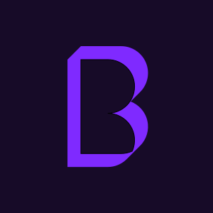
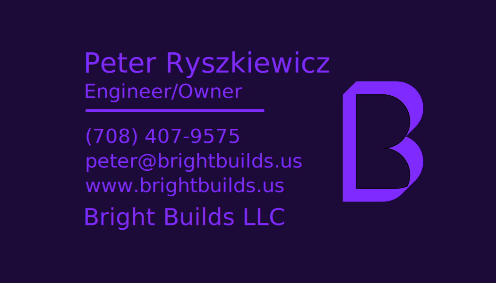
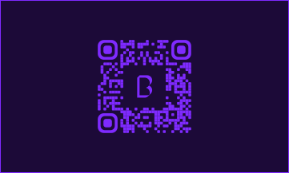

# Bright Builds Logo Assets

<!-- coding-and-architecture-requirements-readme-badges:begin -->
[](https://github.com/bright-builds-llc/logo)
[](./LICENSE)
<!-- coding-and-architecture-requirements-readme-badges:end -->

This repository stores the Bright Builds logo asset library imported from the original source folder, organized for straightforward reuse across product, print, and fabrication workflows.

## At a Glance

The gallery below highlights the repo's most useful preview-ready assets for quick scanning on GitHub.

<table>
  <tr>
    <td align="center">
      <a href="assets/logo/primary/bright-builds-logo.png">
        
      </a>
      <br>
      <strong>Primary Logo</strong>
      <br>
      <sub><a href="assets/logo/primary/bright-builds-logo.png"><code>assets/logo/primary/bright-builds-logo.png</code></a></sub>
    </td>
    <td align="center">
      <a href="assets/logo/legacy/bright-builds-logo-v2-cropped.png">
        
      </a>
      <br>
      <strong>Legacy Square Crop</strong>
      <br>
      <sub><a href="assets/logo/legacy/bright-builds-logo-v2-cropped.png"><code>assets/logo/legacy/bright-builds-logo-v2-cropped.png</code></a></sub>
    </td>
    <td align="center">
      <a href="assets/supporting/frame/bright-builds-frame.png">
        
      </a>
      <br>
      <strong>Supporting Frame</strong>
      <br>
      <sub><a href="assets/supporting/frame/bright-builds-frame.png"><code>assets/supporting/frame/bright-builds-frame.png</code></a></sub>
    </td>
  </tr>
</table>

## Legacy Variants

These earlier logo treatments remain available for reference and compatibility.

<table>
  <tr>
    <td align="center">
      <a href="assets/logo/legacy/bright-builds-logo-v1.svg">
        
      </a>
      <br>
      <strong>Legacy Logo v1</strong>
      <br>
      <sub><a href="assets/logo/legacy/bright-builds-logo-v1.svg"><code>assets/logo/legacy/bright-builds-logo-v1.svg</code></a></sub>
    </td>
    <td align="center">
      <a href="assets/logo/legacy/bright-builds-logo-v2.png">
        
      </a>
      <br>
      <strong>Legacy Logo v2</strong>
      <br>
      <sub><a href="assets/logo/legacy/bright-builds-logo-v2.png"><code>assets/logo/legacy/bright-builds-logo-v2.png</code></a></sub>
    </td>
  </tr>
</table>

## WIP Print Assets

These business-card previews are intentionally shown as works in progress and should not be treated as canonical brand assets.

<table>
  <tr>
    <td align="center">
      <a href="assets/print/business-cards/wip/bright-builds-business-card-front-wip.svg">
        
      </a>
      <br>
      <strong>Business Card Front (WIP)</strong>
      <br>
      <sub><a href="assets/print/business-cards/wip/bright-builds-business-card-front-wip.svg"><code>assets/print/business-cards/wip/bright-builds-business-card-front-wip.svg</code></a></sub>
      <br>
      <sub><a href="assets/print/business-cards/wip/bright-builds-business-card-front-wip.pdf">PDF export</a></sub>
    </td>
    <td align="center">
      <a href="assets/print/business-cards/wip/bright-builds-business-card-back-wip.png">
        
      </a>
      <br>
      <strong>Business Card Back (WIP)</strong>
      <br>
      <sub><a href="assets/print/business-cards/wip/bright-builds-business-card-back-wip.png"><code>assets/print/business-cards/wip/bright-builds-business-card-back-wip.png</code></a></sub>
      <br>
      <sub><a href="assets/print/business-cards/wip/bright-builds-business-card-back-wip.pdf">PDF export</a></sub>
    </td>
  </tr>
</table>

## Canonical Assets

The default logo set is the `logov3` family:

- `assets/logo/primary/bright-builds-logo.svg`
- `assets/logo/primary/bright-builds-logo.png`

Legacy logo variants remain available under `assets/logo/legacy/` for reference and compatibility.

## Repository Layout

```text
assets/
  logo/
    primary/
    legacy/
    3d/
  print/
    business-cards/
      wip/
  supporting/
    frame/
docs/
  source-manifest.md
```

## Asset Notes

- `assets/logo/primary/` contains the current default vector and raster logo assets.
- `assets/logo/legacy/` preserves earlier logo variants and related export formats.
- `assets/logo/3d/` contains fabrication-oriented source material.
- `assets/print/business-cards/wip/` contains in-progress business card exports and source artwork.
- `assets/supporting/frame/` contains supporting frame assets that are not treated as the default logo.

## Provenance

Imported files are stored as byte-identical copies of the source assets. Original filenames, source timestamps, categories, and normalized repo paths are documented in `docs/source-manifest.md`.
